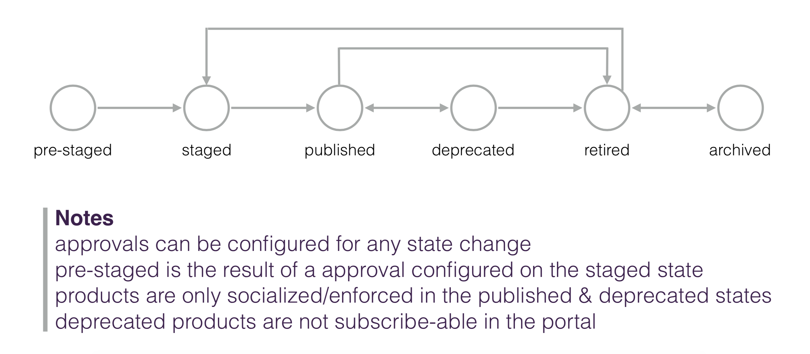

# Production Lifecycle

Authors:
- [Shane Claussen](mailto:claussen@us.ibm.com), Distinguished Engineer & Chief Architect, API Connect
- [Sumanto Biswas](mailto:biswas@us.ibm.com), Development Lead, API Connect
- **Pramodh Ramesh**, Offering Management Lead
- **Anh Le**, Developer


## Introduction

APIs that are ready to be published into production have a much
broader set of considerations than APIs under development.  The key
difference is that these APIs are likely updates to existing APIs that
are already in production.  Thus, the new version of the API needs to
be published without disrupting the existing consumer applications
subscribed to and invoking the prior version(s).  In addition,
strategies for migrating consumer application subscriptions between
product versions will need to be considered.


## Catalog Configuration

APIs being published into production are typically phased through
atleast two catalogs, sometimes more.  In this article we will assume
two catalogs, one named **staging** and another named **production**.
Those catalogs may be part of the same API provider organization, two
different provider organizations in the same API Connect instance, or
two different provider organizations in two physically disparate
instances.  The instance, provider organization, and catalog
cardinaity is dependent on corporate organization and compliance
criteria that are outside the scope of this article.

API Connect supports a boolean catalog configuration property named
`production` that has a critical impact on the behavior of the
catalog.  **For staging and production catalogs we recommend setting
this property `true`.** The `true` value results in behavior that
requires new API products being published to the catalog to have a
unique name and/or version that doesn't conflict with existing API
products that already exist in the catalog.

For example, a production typed catalog can support:

```
1. Publish Climbon v100 product
2. Publish Hiking v100 product
3. Publish Climbon v200 product
```

The example above would result in the co-publishing of two versions of
the Climbon product and a single version of the Hiking product in the
catalog.

However, the following is not supported in a production typed catalog:

```
1. Publish Climbon v100 product
2. Publish Hiking v100 product
3. Publish Climbon v100 product
```

Step 3 would fail for a production typed catalog.  Even though the
product has the same name and version, there is no guarantee that its
contents are the same.  Publishing a different set of contents would
thus likely result in a disruption for the existing consumers of the
Climbon v100 product.  In summary, production typed catalogs provide
some safety constraints requiring explicit governance and control in
production to minimize disrupting existing API consumers.

Sample script(s):
- [Setting the catalog production property to true](./sh/catalog-production-true.sh)


## Packaging APIs into API Products

In order for APIs to be published to production they must be packaged
in API Products (referred to here as products).  Products contain one
or more plans.  API consumers subscribe to a product's plan enabling
them to invoke any API packaged in the API product that the plan
supports.  APIs should be grouped into products dependent on the
intended consumer consumption model for the APIs.  Plans can be used
to differentiate rate limits, provide access to a subset of the APIs
in a product, or a subset of the operations provided by an API.

Some common examples:

- In the simplest form, a product may have a single plan with an
  unlimited rate limit that references a single API.

- A product may packagine multiple APIs under a single plan.

- A product may packagine multiple APIs under various plans that
  are differentiated by rate limits.

- A product may package multiple APIs and support multiple plans.  The
  plans may provide progressive disclosure to the APIs and/or API
  operations and vary invocation rate limits.

The relationship between an API product and the API is by reference so
the term packaging really means "referencing an API".  To clarify, an
API may be packaged into multiple products (or referenced by multiple
products).  For example, the following pseudo-code demonstrates two
products that reference multiple APIs, one of which is common:

```
Create Tourism v100 product and reference Routes v100 API and Trails v100 API
Create Climbon v100 product and reference Routes v100 API and Climbing Destinations v100 API
Publish Tourism v100 product
Publish Climbon v100 product
```

The result of the above is a catalog containing:
- Tourism v100 product
- Climbon v100 product
- Routes v100 API
- Trails v100 API
- Climbing Destinations v100 API


Thus, the result is there's only one copy of the Routes v100 API in
the catalog, and it can be invoked by consumers who subscribe to
either the Tourism or the Climbon product.


## Product Lifecycle and Co-Publishing

API products transition through a set of states when they are deployed
to a catalog that are important to understand.  Here is a summary of
the states:

- **Pre-Staged**: If staging requires human task approvals, staged a
  product transitions into the pre-staged state.  Once the task is
  approved, Pre-Stated products transition to Staged.

- **Staged**: Staging a product to a catalog will result in the product
  being in the Staged state.  Staged products are not yet "published",
  meaning, they are not yet subscribeable, not visible in the
  developer portal, nor are they enforced by the gateway.  The staged
  state is essentially represents the "green room" for products; a
  holding state prior to publishing.  The typical transition from the
  Staged state is to the Published state.

- **Published**: Published products are subscribeable, visible in the
  developer portal, and enforced by the gateway.  Published products
  can be transitioned to Deprecated or Retired.

- **Deprecated**: Deprecated products are very similar to Published
  products, however, they are NOT subscribeable.  Deprecated products
  do continue to be enforced by the gateway supporting existing
  consumer application invocations of the referenced APIs.  Deprecated
  products can be returned to the Published state or to the Retired
  state.

- **Retired**: Retired products are no longer subscribeable, visible in
  the developer portal, or enforced by the gateway.  Retired products
  can be re-staged, transitioned to the Archived state, or they can be
  removed altogether from the catalog.

- **Archived**: Archived products are a form of retired products that
  are not directly visible by default in the API Manager user
  experience.  They can be removed from the catalog or transitioned
  back to the Retired state.

It is helpful to understand the product lifecycle particularly as it
relates to different versions of the same product published to the
production catalog.  For example, the following is a pretty typical
scenario when publishing subsequent versions of the same product over
extended periods of time (eg weeks/months/years):

```
T1. Publish Climbon v100
T2. Publish Climbon v101 and Deprecate Climbon v100
T3. Publish Climbon v200
T4. Deprecate Climbon v101 and Climbon v200
T5. Retire/Remove Climbon v101 and Climbon v200
```

At time 2, there may be many subscribers for Climbon v100 that can
continue to invoke its APIs but new subscribers will subscribe to
Climbon v101 and begin invoking its APIs.

At time 3, a new version of the Climbon product is co-published with
the two initial versions.

At time 4, all three versions of the products are now deprecated, so
they remain invokeable, but consumers can no longer subscribe.

And finally at time 5, the APIs are retired and removed from the
catalog.


## API Lifecycle

The APIs referenced by products that have been published to catalogs
also have the following lifecycle states:

- **Staged**: The state of an API whose product is in the Pre-Staged
  or Staged state.

- **Online**: The state an API transitions to when the product
  referencing it is published.  In this state, any consumer that has a
  subscription to the product referencing the API can now invoke the
  API.  Online APIs can be transitioned to the Offline state.  They
  are also automatically transitioned to the Retired state when the
  last product referencing the API is retired.

- **Offline**: In this state the API is no longer invokeable by the
  gateway although its product remains in the Published or
  Deprecreated state.  Offlien APIs can be transitioned back to the
  Online state.  They are also automatically transitioned to the
  Retired state when the last product referencing the API is retired.

- **Retired**: The state of an API referenced by a product that's been
  retired or archived.  Note that retiring a product removes its
  subscriptions since it's no longer invokeable.  If a retired product
  is re-staged and published again, it will start the lifecycle over
  without subscriptions.

The API state can be modified when the product that references the API
is in the published or deprecated state.  At that point, the API can
be toggled between the Online and Offline states.  This scenario is
useful when the API needs to be taken offline temporarily without
impacting the other APIs referenced by the product.

In a scenario where an API is referenced by multiple products, taking
it Offline impacts all of the subscribers of all the products
referencing the API.





## Product Lifecycle Scenarios

The ability to co-publish multiple versions of a product surfaces the
issues of migrating subscriptions between multiple versions.
Migration scenarios range from relatively simple to very complex.  It
is important for API provider organizations to clearly define what
level of freedom of definition they intend to support.

Here are some common scenarios.


### **Replace**

In this scenario the API provider team discovers spelling errors in
the descriptions of the API operations that have already been
published for which there are already many consumers.  The provider
team's goal is to fix the problem, publish the new version, and then
migrate all tsubscriptions from old product/API to the new version
without any disruption.  We term this scheme a *hot replace* scenario
that uses a *provider side migration* technique.

```
T1. Publish Climbon v100 product with Gold plan and Routes v100 API
T2. Version Routes v101 fixing the spelling issues
T3. Version Climbon v101 to reference Routes v101
T4. Publish Climbon v101 and Deprecate Climbon v100
T5. Migrate subscriptions from Climbon V100 to Climbon V101
T6. Retire Climbon v100
```

Although several CLI or REST operations can be orchestrated together
to support the above scenario API Connect provides a single macro
CLI/operation named **replace** that supports all of the above
lifecycle operations from T4 to T6 in a single step.

For example:
```
T1. Publish Climbon v100 product with Gold plan and Routes v100 API
T2. Stage Climbon v101 product with Gold plan and Routes v101 API
T3. Replace Climbon v100 with Climbon v101
```

The replace macro operation can only be used when the subsequent
product contains a proper superset of the plans and APIs from the
prior product.


### **Supersede**

In addition to low risk changes in the API, a process needs to exist
to support breaking or higher risk changes in the API set.  Here is a
pretty typical solution to that problem that results in products and
APIs being superseded and defers retesting and migrating the
application to the API consumers.

```
T1. Stage Climbon V100 product with the Gold plan and Routes v100 API
T2. Publish Climbon v100 product
T3. Version Routes v200 API with a high risk and/or breaking change
T4. Version Climbon v200 product with Routes v200 API
T5. Stage Climbon V200
T6. Publish Climbon v200
T7. Deprecate Climbon v100
T8. Set Climbon v100 migration target to Climbon v200
T9. Allow each consumer of Climbon v100 to test against v200 and perform consumer side migration
T10. Once all consumers have migrated to Climbon v200, Retire/Remove Climbon v100
```

Similar to the replace macro operation, API Connect provides a single
macro CLI/REST operation to perform the relevant lifecycle operations
for a supersede in a single set.  Using this macro operation results
in the following:

```
T1. Stage Climbon V100 product with the Gold plan and Routes v100 API
T2. Publish Climbon v100 product
T3. Version Routes v200 API with a high risk and/or breaking change
T4. Version Climbon v200 product with Routes v200 API
T5. Stage Climbon V200
T6. Supersede Climbon v100 with Climbon v200
T7. Allow each consumer of Climbon v100 to test against v200 and perform consumer side migration
T8. Once all consumers have migrated to Climbon v200, Retire/Remove Climbon v100
```


### **Other**

Another thing to consider is that subsequent versions of a product may
take a very different shape than prior versions.  For example, as the
product version evolves, the referenced APIs may evolve, eg updated
API versions, new APIs, or different APIs altogether.  In addition,
plans may evolve as well.  Here's a simple product lifecycle for
consideration:

```
T1: Climbon v100 product with a Gold plan and Routes v100 API
T2: Climbon v101 product with a Gold plan and Routes v101 API with minor description text updates
T3: Climbon v110 product with a Gold plan and Routes v110 API containing new operations
T4: Climbon v200 product with a Premium and Freemium plans and Routes v200 API and Climbing Destinations v100 API
T4: Climbon v200 product is replaced by the Outdoors v300 product/Routes v200 API and Destinations v300 product/Climbing Destinations v300 API each with a single *Default* plan
```

To support these more complex scenario API Connect provides all the
basic building block CLIs and REST operations.  These operations can
be used to update the product state, set migration targets at a
product or plan level, or perform provider side migration tasks.


## Partial Publishing

*...more to come...*


## Product Visibility

When products are published they are visible to all consumers of the
catalog (typically via the developer portal user experience).  There
are cases though where there are products published for a single
consumer or group of consumers.  API Connect supports this by
providing the option of changing the default visibility when the
product is published, or updating the visibility for product that is
in the Published or Deprecated states.

*...more to come...*


## Sample Scripts

As we mentioned above, API Connect provides CLIs & REST operations to
support all the lifecycle capability described above.  The following
are a sample set of curl scripts to support many common publishing
tasks.

The sample scripts assume a production catalog that has been properly
configured.  For example, the catalogs identity provider and gateway
services should be configured prior to invoking these scripts.

All of the sample scripts use some subset of the following environment
variables:

```
MANAGEMENT=management-server-address.com

PROVIDER_REALM=provider/corporate-idp
PROVIDER_USERNAME=user@acme.com
PROVIDER_PASSWORD=some-password
PROVIDER_TOKEN=<response from provider login step below>

PORG=acme
CATALOG=production

CLIMBON100_PRODUCT_URL=<product url of climbon 100 when published>
CLIMBON101_PRODUCT_URL_=<product url of climbon 101  when published>
CLIMBON200_PRODUCT_URL=<product url of climbon 200 when published>

CONSUMER_IDP=consumer-user-registry
CONSUMER_REALM=consumer:acme:production/consumer-idp
CONSUMER_USERNAME=consumer@acme.com
CONSUMER_PASSWORD=some-password
CONSUMER_TOKEN=<response from consumer login step below>
CONSUMER_EMAIL=consumer@acme.com
CONSUMER_FIRSTNAME=Andre
CONSUMER_LASTNAME=Consumer
CONSUMER_OWNER_URL=<user url of consumer org owner>

CORG=corg
CORG_TITLE=<some corg title>

APP=test-app
APP_TITLE=<some app title>
```

To keep the curl commands simple, the *Content-Type* and *Accept*
headers have been removed from the curl operations.  Thus, each POST
and PATCH also requires these command line flags: `-H
'Content-Type:application/json' -H 'Accept:application/json'`


#### Provider Authentication Script

Authenticate as the user who will be performing the product publishing and catalog management tasks.

```
curl -X POST https://$(MANAGEMENT)/api/token -i -s \
      -d '{ "realm": "$(PROVIDER_REALM)",
            "username": "$(PROVIDER_USERNAME)",
            "password": "$(PROVIDER_PASSWORD)",
            "client_id": "caa87d9a-8cd7-4686-8b6e-ee2cdc5ee267",
            "client_secret": "3ecff363-7eb3-44be-9e07-6d4386c48b0b",
            "grant_type": "password" }'
```

Notes:

- The *client_id* and *client_secret* can be used directly as
  specified above.

- The response will contain the token that should be added to the
  PROVIDER_TOKEN environment variable used in the scripts below.


#### Product Stage and Publish Script

Although it's possible to go directly from the file system into the
Published state, it's typical for production scenarios that a two step
stage and publish process is used.  This is typically a function of
timing goals and the human tasks in production catalogs associated
with these lifeycle states.

```
curl -X POST https://$(MANAGEMENT)/api/catalogs/$(PORG)/$(CATALOG)/stage -i -s \
     -H 'Authorization:Bearer $(PROVIDER_TOKEN)' \
     -F "product=@climbon100.yaml;type=application/yaml"
     -F "openapi=@routes100.yaml;type=application/yaml"
     -F "openapi=@trails100.yaml;type=application/yaml"

curl -X PATCH $(CLIMBON100_PRODUCT_URL) -i -s \
     -H 'Authorization:Bearer $(PROVIDER_TOKEN)' \
     -d '{ "state": "published" }'
```

Notes:

- The *product=* refers to the file system location of the product's
  YAML definition that is being published.  The *openapi=* refers to
  OpenAPI definitions referenced by the product being published.

- The CLIMBON100_PRODUCT_URL used in the second curl request is the
*url* property returned in the response for the first curl command
(stage).


#### Consumer Organization and Consumer User Creation Script

```
curl -X POST https://$(MANAGEMENT)/api/user-registries/$(PORG)/$(CATALOG_IDP)/users -i -s -k \
     -H 'Authorization:Bearer $(PROVIDER_TOKEN)' \
     -d '{ "identity_provider": "$(CONSUMER_IDP)",
           "username": "$(CONSUMER_USERNAME)",
           "password": "$(CONSUMER_PASSWORD)",
           "email": "$(CONSUMER_EMAIL)",
           "first_name": "$(CONSUMER_FIRSTNAME)",
           "last_name": "$(CONSUMER_LASTNAME)" }'

curl -X POST https://$(MANAGEMENT)/api/catalogs/$(PORG)/$(CATALOG)/consumer-orgs -i -s -k \
     -H 'Authorization:Bearer $(PROVIDER_TOKEN)' \
     -d '{ "name": "$(CORG),
           "title": "$(CORG_TITLE)",
           "owner_url": "$(CONSUMER_OWNER_URL)" }'
```

Notes:

- The CONSUMER_OWNER_URL in the second curl request is the **url**
  property from the response of the first call


#### Consumer Authentication Script

Authenticate as the user who will be creating the consumer application
and subscribing to the product.

```
curl -X POST https://$(MANAGEMENT)/consumer-api/token -i -s \
      -H 'X-IBM-Consumer-Context': '$(PORG).$(CATALOG)' \
      -d '{ "realm": "$(CONSUMER_REALM)",
            "username": "$(CONSUMER_USERNAME)",
            "password": "$(CONSUMER_PASSWORD)",
            "client_id": "819a8de7-7204-4adb-918f-391ba39d29d0",
            "client_secret": "8dad5699-acbf-40ab-85c1-48361981bc75",
            "grant_type": "password" }'
```

Notes:

- The *client_id* and *client_secret* can be used directly as
  specified above.

- The response will contain the token that should be added to the
  CONSUMER_TOKEN environment variable used in the scripts below.


#### Consumer Application and Product Subscription Script

```
curl -X POST https://$(MANAGEMENT)/consumer-api/orgs/$(CORG)/apps -i -s -k \
     -H 'X-IBM-Consumer-Context': '$(PORG).$(CATALOG)' \
     -H 'Authorization:Bearer $(CONSUMER_TOKEN)' \
     -d '{ "name": "$(APP)",
           "title": "$(APP_TITLE)" }'

curl -X POST https://$(MANAGEMENT)/consumer-api/orgs/$(CORG)/subscriptions -i -s -k \
     -H 'X-IBM-Consumer-Context': '$(PORG).$(CATALOG)' \
     -H 'Authorization:Bearer $(CONSUMER_TOKEN)' \
     -d '{ title: 'Subscription of $(APP_TITLE) to the climbon:100 product',
           product_url: 'https://$(MANAGEMENT)/consumer-api/products/climbon/100',
           plan: 'gold' }'
```


#### Product Deprecation Script

```
curl -X PATCH $(CLIMBON100_PRODUCT_URL) -i -s \
     -H 'Authorization:Bearer $(PROVIDER_TOKEN)' \
     -d '{ "state": "deprecated" }'
```


#### Retire/Remove Script

```
curl -X PATCH $(CLIMBON100_PRODUCT_URL) -i -s \
     -H 'Authorization:Bearer $(PROVIDER_TOKEN)' \
     -d '{ "state": "retired" }'

curl -X DELETE $(CLIMBON100_PRODUCT_URL) -i -s \
     -H 'Authorization:Bearer $(PROVIDER_TOKEN)'
```


#### API Offline/Online Script

```
curl -X POST https://$(MANAGEMENT)/api/catalogs/$(PORG)/$(CATALOG)/apis/routes/100 -i -s \
     -H 'Authorization:Bearer $(PROVIDER_TOKEN)' \
     -d '{ "state": "offline" }'

curl -X POST https://$(MANAGEMENT)/api/catalogs/$(PORG)/$(CATALOG)/apis/routes/100 -i -s \
     -H 'Authorization:Bearer $(PROVIDER_TOKEN)' \
     -d '{ "state": "online" }'
```


#### Product Replace Script

```
curl -X POST https://$(MANAGEMENT)/api/catalogs/$(PORG)/$(CATALOG)/stage -i -s \
     -H 'Authorization:Bearer $(PROVIDER_TOKEN)' \
     -F "product=@climbon101.yaml;type=application/yaml"
     -F "openapi=@routes101.yaml;type=application/yaml"
     -F "openapi=@trails101.yaml;type=application/yaml"

curl -X PATCH $(CLIMBON101_PRODUCT_URL) -i -s \
     -H 'Authorization:Bearer $(PROVIDER_TOKEN)' \
     -d '{ "state": "published" }'

curl -X POST $(CLIMBON101_PRODUCT_URL)/replace -i -s \
     -H 'Authorization:Bearer $(PROVIDER_TOKEN)' \
     -d '{ "product_url": $(CLIMBON100_PRODUCT_URL),
           "plans": [
             { "source": 'bronze', "target": 'bronze' },
             { "source": 'silver', "target": 'silver' }
             { "source": 'gold', "target": 'gold' }
           ]
         }'
```

Notes:

- The above assumes the climbon:100 product was already published (see
  product stage/publish script).

- The CLIMBON101_PRODUCT_URL in the second curl request is the *url*
  property from the response of the first call.


#### Product Supersede Script

```
curl -X POST https://$(MANAGEMENT)/api/catalogs/$(PORG)/$(CATALOG)/stage -i -s \
     -H 'Authorization:Bearer $(PROVIDER_TOKEN)' \
     -F "product=@climbon200.yaml;type=application/yaml"
     -F "openapi=@routes200.yaml;type=application/yaml"
     -F "openapi=@trails200.yaml;type=application/yaml"

curl -X PATCH $(CLIMBON200_PRODUCT_URL) -i -s \
     -H 'Authorization:Bearer $(PROVIDER_TOKEN)' \
     -d '{ "state": "published" }'

curl -X POST $(CLIMBON200_PRODUCT_URL)/supersede -i -s \
     -H 'Authorization:Bearer $(PROVIDER_TOKEN)' \
     -d '{ "product_url": $(CLIMBON101_PRODUCT_URL),
           "plans": [
             { "source": 'bronze', "target": 'bronze' },
             { "source": 'silver', "target": 'silver' }
             { "source": 'gold', "target": 'gold' }
           ]
         }'
```

Notes:

- The command above assumes climbon:101 has already been published.

- The CLIMBON200_PRODUCT_URL in the second curl request is the *url*
  property from the response of the first curl command.
